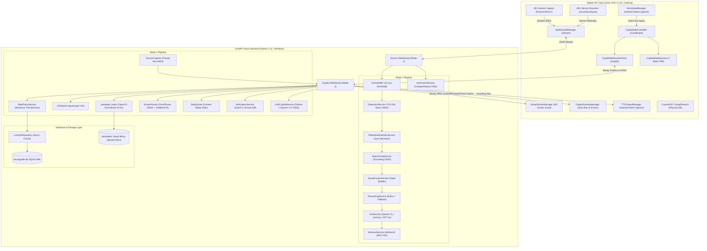

# NeuroGuide XR: End-to-End System Architecture & Project Engineering Report

**Project Title:** NeuroGuide XR — A Hierarchical Multi-Modal Framework for Context-Aware Spatial Assistance Across Physical Environments and Desktop Interfaces  
**Project Type:** Final Year Project (FYP) & Enterprise Spatial AI Platform  
**Target Hardware:** Windows Workstation (Host & Backend) + Android Mobile AR (Samsung Galaxy S25 Ultra / ARCore)  
**Document Version:** 8.0 (Comprehensive End-to-End Report)  
**Date:** September 2026  

---

## Table of Contents

1. [Executive Summary & System Vision](#1-executive-summary--system-vision)
2. [Dual-Domain Operational Paradigms](#2-dual-domain-operational-paradigms)
   - [2.1 Mode 1: Physical Live Scene Assistance (Physical Domain)](#21-mode-1-physical-live-scene-assistance-physical-domain)
   - [2.2 Mode 2: Spatial Software UI Assistance & Enterprise Training (Digital Domain)](#22-mode-2-spatial-software-ui-assistance--enterprise-training-digital-domain)
3. [End-to-End System Architecture](#3-end-to-end-system-architecture)
   - [3.1 High-Level Architecture Diagram](#31-high-level-architecture-diagram)
   - [3.2 The Decoupled Perception & Reasoning Hierarchy](#32-the-decoupled-perception--reasoning-hierarchy)
4. [Backend Implementation & Service Inventory (`backend/`)](#4-backend-implementation--service-inventory-backend)
   - [4.1 Service Layer Catalog (22 Services Deep Dive)](#41-service-layer-catalog-22-services-deep-dive)
   - [4.2 WebSocket Protocols & API Endpoints](#42-websocket-protocols--api-endpoints)
   - [4.3 Database Architecture & Schema v2.0 (`backend/db/`)](#43-database-architecture--schema-v20-backenddb)
   - [4.4 Ingestion & Trajectory Extraction Tools (`extract_capture.py`, `ingest.py`)](#44-ingestion--trajectory-extraction-tools-extract_capturepy-ingestpy)
   - [4.5 Environment & Multi-Provider AI Configuration (`config.py`)](#45-environment--multi-provider-ai-configuration-configpy)
5. [Unity AR Client Architecture (`AIASSISTEDXR/`)](#5-unity-ar-client-architecture-aiassistedxr)
   - [5.1 Project Structure & Scene Hierarchy](#51-project-structure--scene-hierarchy)
   - [5.2 C# Core & Native Bridge Implementations](#52-c-core--native-bridge-implementations)
   - [5.3 Copilot & Spatial Screen Rendering Engine](#53-copilot--spatial-screen-rendering-engine)
   - [5.4 Physical Scene Guidance & HUD (`AROverlayManager`, `CoachHUD`)](#54-physical-scene-guidance--hud-aroverlaymanager-coachhud)
6. [Comprehensive Status Audit: What is Done vs. What Will Be Done](#6-comprehensive-status-audit-what-is-done-vs-what-will-be-done)
   - [6.1 Audit Matrix Across All Implementation Phases (Phase 0 to Phase 6)](#61-audit-matrix-across-all-implementation-phases-phase-0-to-phase-6)
   - [6.2 Verified Completed Features & Artifacts (Done ✅)](#62-verified-completed-features--artifacts-done-)
   - [6.3 Planned Roadmap & Next Engineering Steps (To Be Done 🔨)](#63-planned-roadmap--next-engineering-steps-to-be-done-)
7. [System Latency Budget, Resource Profiling & Benchmarks](#7-system-latency-budget-resource-profiling--benchmarks)
8. [Deployment, Build Instructions & Environment Setup](#8-deployment-build-instructions--environment-setup)

---

## 1. Executive Summary & System Vision

**NeuroGuide XR** resolves a fundamental dilemma in modern spatial computing: **how to deliver real-time, responsive, context-aware Augmented Reality (AR) guidance without succumbing to the high latencies (1.5s–5.0s), compute bottlenecks, thermal throttling, and bandwidth expenses of continuous cloud Vision-Language Model (VLM) streaming.**

Current AR systems are bifurcated:
1. **Physical task guidance** (industrial assembly, fitness coaching, culinary training) typically relies on brittle computer vision, static AR fiducial markers, or unconstrained VLM calls that lag behind user action.
2. **Software UI training** remains confined to 2D screen recordings, static PDFs, or traditional mouse-and-keyboard screen sharing, completely detached from the physical workspace.

NeuroGuide XR bridges physical real-world object guidance and digital desktop software tutoring within a **single, unified mobile XR spatial viewport**, powered by an asynchronous **hierarchical gated perception pipeline** on a hybrid local/cloud backend.

```
┌────────────────────────────────────────────────────────────────────────────────────────────────────────┐
│                                       NEUROGUIDE XR PLATFORM                                           │
├────────────────────────────────────────────────────┬───────────────────────────────────────────────────┤
│          MODE 1: PHYSICAL LIVE SCENE ASSISTANCE    │       MODE 2: SPATIAL SOFTWARE UI COPILOT         │
│  - Real-world 6-DoF AR camera tracking             │  - Real-time PC screen streamed to AR canvas     │
│  - YOLO26 ONNX equipment detection (8-15 ms)       │  - Two-path: Expert Lessons vs Zero-Shot LLM      │
│  - Triggered Grounding DINO open-vocab (80-150 ms) │  - 96x96 Auto-extracted visual template library   │
│  - Deep multimodal VLM snapshot reasoning          │  - Tiered resolution: pywinauto → Template → Omni │
│  - Domain personas: Gym Coach, Chef, Physio        │  - Closed-loop SSIM/pixel delta step verification │
│  - Physical world-anchored 3D guidance cards       │  - Native Android STT voice input & spoken TTS    │
└────────────────────────────────────────────────────┴───────────────────────────────────────────────────┘
```

---

## 2. Dual-Domain Operational Paradigms

### 2.1 Mode 1: Physical Live Scene Assistance (Physical Domain)

In Mode 1 (`SampleScene.unity`), the learner aims their smartphone (or AR glasses) at the real-world environment.
- **Dynamic Sensor Streaming:** Unity captures high-definition camera frames alongside device inertial kinematics (accelerometer, gyroscope, attitude quaternion) at 30 FPS.
- **Inertial & Temporal Compute Gating:** The backend applies complementary filtering to smooth IMU telemetry and computes mean gray-level pixel differences ($\Delta_{\text{diff}}$). When the user is static or the environment has not changed, expensive neural inference is bypassed, serving cached guidance. If high angular acceleration indicates erratic device movement, inference is held to prevent motion-blur misclassifications.
- **Tiered Computer Vision:**
  - *Tier 1 (Fast Object Detection):* YOLO26 Nano (ONNX Runtime, 6 MB) detects canonical objects (e.g., dumbbells, barbells, benches, gym machines) in **8–15 ms**.
  - *Tier 1b (Roboflow Custom Model):* Specialized gym machine detector (`flat bench press`, `incline bench press`, `lat pulldown`, `leg press`) identifying equipment in real-time.
  - *Tier 2 (Open-Vocabulary Grounding):* Grounding DINO Tiny is triggered conditionally when YOLO confidence is low ($\tau < 0.55$), when a significant scene transition occurs, or upon explicit user voice query.
  - *Tier 3 (Deep Multimodal VLM Analysis):* When the user taps **Snap** or asks an ad-hoc question, an asynchronous VLM (local `qwen3-vl:4b` or cloud `gemma4:31b` / `gpt-4o`) evaluates posture, form, safety hazards, and exercise execution.
- **Exercise Intelligence Integration:** Connects to the WorkoutX API (`workout_service.py`) to fetch exact exercise instructions, target muscle groups, secondary muscles, and animated demonstration GIFs.
- **Spatial 3D Overlays:** Renders floating world-anchored directional arrows, glowing bounding boxes, and clamped distance cards (1.1m to 2.2m from the camera) that preserve situational awareness.

---

### 2.2 Mode 2: Spatial Software UI Assistance & Enterprise Training (Digital Domain)

In Mode 2 (`CopilotAR.unity`), the learner points the AR viewport toward a virtual floating workstation canvas displaying their live PC screen in high definition.

#### A. Architectural Separation: Training Path vs. Runtime Path
A major engineering principle established in the project architecture is that **OpenAdapt is strictly a training-time tool, not a runtime tool**.

```
═════════════════════════════════════════════════════════════════════════════════════════════
                         TRAINING PATH (Trainer / Subject Matter Expert)
═════════════════════════════════════════════════════════════════════════════════════════════
  Trainer records target workflow once (OpenAdapt / Video Capture)
       │
  OpenAdapt captures: Mouse clicks, keyboard input, window handles, timestamps, screen video
       │
  extract_capture.py & demo_ingestor.py
       ├── For each click: Crop 96×96 px patch around (x, y) → save PNG in templates/<app>/
       ├── Ground click coordinate to UI label via OmniParser or Windows UIA
       ├── Compose coaching narration via GuidanceComposer (Ollama / LLM)
       └── Save normalized lesson, steps, and templates to neuroguide.db (SQLite WAL)

═════════════════════════════════════════════════════════════════════════════════════════════
                         RUNTIME PATH (Learner in Augmented Reality)
═════════════════════════════════════════════════════════════════════════════════════════════
  Learner speaks question: "How do I insert a rectangle shape?"
       │
  /copilot WebSocket receives query
       ├── Step Policy (Sentence-Transformers all-MiniLM-L6-v2): Matches pre-recorded lesson
       │   └── Found (Confidence ≥ 0.60): Serve pre-verified DB lesson steps
       │   └── Not Found: Fall back to zero-shot LLM (Ollama / OpenAI / UI-TARS)
       │
  Resolution Chain (Fast First):
       ├── 1. pywinauto UIA (Win32 Accessibility)       ~5 ms    (Fastest)
       ├── 2. OpenCV Template Matching (96x96 patch)    ~15 ms   (Robust across scaling)
       ├── 3. OmniParser ONNX Visual Parse             ~350 ms   (Fallback for custom UI)
       └── 4. PaddleOCR Text Recognition               ~500 ms   (Last resort)
       │
  Spatial Augmented Reality Experience:
       ├── Live PC screen streamed over binary WebSocket (~15 FPS JPEG) to AR Quad
       ├── Glowing animated highlight box + bouncing 3D arrow pinpoint exact target
       ├── Android Native TTS speaks coaching narration
       │
  User clicks software target on PC → step_done event sent to backend
       │
  VerificationService: Pre/post screenshot structural difference (SSIM/pixel delta)
       ├── Passed (diff ≥ 0.008): Congratulate user, lazy-resolve next step, advance FSM
       ├── Failed: Instruct retry; Failsafe bypass triggers after 2 consecutive attempts
```

---

## 3. End-to-End System Architecture

### 3.1 High-Level Architecture Diagram



---

### 3.2 The Decoupled Perception & Reasoning Hierarchy

NeuroGuide XR achieves responsive performance by enforcing strict computational stratification. No high-cost neural network is called if a lower-cost tier can resolve the context:

| Tier | Module | Processing Time | Compute Cost | Invocations | Purpose |
|---|---|---|---|---|---|
| **Tier 0** | `ImuFusionService` & `FrameDiffer` | < 2 ms | Negligible (CPU) | 100% of frames | Gating: Discards static frames or motion-blurred erratic camera angles. |
| **Tier 1** | `DetectionService` (YOLO26n ONNX) | 8–15 ms | Very Low (CPU/GPU) | ~30% of frames | Real-time object and gym equipment identification. |
| **Tier 1b** | `UIDetector` (pywinauto UIA) | ~5 ms | Negligible (OS API) | Step initialization | Instant software accessibility tree lookup. |
| **Tier 1c** | `_template_match` (OpenCV NCC) | ~15 ms | Low (CPU) | Step initialization | 96x96 pixel correlation against pre-baked trainer patches. |
| **Tier 2** | `OpenVocabService` (Grounding DINO) | 80–150 ms | Medium (GPU/CPU) | On-demand (~5%) | Triggered on low confidence ($\tau < 0.55$) or scene change. |
| **Tier 2b** | `ScreenParser` (OmniParser ONNX) | ~350 ms | Medium (GPU/CPU) | Fallback only | Visual UI icon/button bounding box parser when UIA fails. |
| **Tier 3** | `VlmService` (Qwen3-VL / Gemma / GPT-4o) | 1.2–3.5 s | High (VRAM / Cloud) | Manual / Snap (~1%) | Deep scene parsing, posture reasoning, multi-turn QA. |

---

## 4. Backend Implementation & Service Inventory (`backend/`)

The Python backend is built with **FastAPI** using non-blocking asynchronous concurrency (`asyncio`). High-compute ML inference tasks run inside thread pools (`asyncio.to_thread`) to prevent blocking the main event loop.

### 4.1 Service Layer Catalog (22 Services Deep Dive)

```
backend/services/
├── __init__.py
├── demo_ingestor.py             # OpenAdapt JSON ingestion & 96x96 template extraction
├── detection_service.py          # YOLO26 Nano ONNX object detection service
├── frame_differ.py               # Pixel delta change detector & compute gate
├── guidance_composer.py          # LLM-based TTS coaching sentence generator
├── imu_fusion_service.py         # Complementary filter & device motion energy estimator
├── lesson_repository.py          # Async CRUD layer over SQLite WAL schema
├── llm_service.py                # Multi-provider UI step generation (Ollama, OpenAI, UI-TARS)
├── open_vocab_service.py         # Grounding DINO open-vocabulary detector
├── pipeline_service.py           # Master coordinator for Mode 1 live scene assistance
├── reasoning_service.py          # Hybrid rule-based & fallback VLM reasoning
├── roboflow_detection_service.py # Specialized custom gym machine detector
├── safety_gate.py                # Content safety filter for spoken coaching text
├── scene_fusion_service.py       # Detections merger & unified SceneState builder
├── screen_capture.py             # Thread-local mss screen capture engine
├── screen_parser.py              # Microsoft OmniParser ONNX + PaddleOCR unified grounder
├── step_policy_service.py        # Sentence-Transformers RAG semantic lesson retriever
├── ui_detector.py                # Windows pywinauto UIA accessibility resolver
├── verification_service.py       # OpenCV pre/post screen diff step verifier
├── vlm_service.py                # Multimodal Vision LLM service (Ollama/OpenAI)
└── workout_service.py            # WorkoutX exercise database client & exercise recommender
```

#### Detailed Breakdown of Key Modules:

1. **`screen_parser.py` (Visual UI Grounding):**
   Combines Microsoft OmniParser (YOLO-based UI detector exported to ONNX) and PaddleOCR. Translates pixel screenshots into structured bounding boxes with control types and text labels. Operates strictly as a fallback when native OS accessibility fails.

2. **`verification_service.py` (Closed-Loop Step Verification):**
   Compares screen state immediately before a step instruction with the screen state after the user signals completion (`step_done`). Calculates absolute grayscale differences, generates a normalized diff score (0.0 to 1.0), evaluates against a tuned threshold (`0.008`), and dynamically creates encouraging coaching TTS audio feedback.

3. **`safety_gate.py` (Speech Safety Gate):**
   Sits between the AI narration engines and the mobile Android TTS speaker. Evaluates text against profanity filters, hallucination markers, and unsafe instructions. Configured with NVIDIA NeMo / Nemotron-3.5-Content-Safety API integration stubs for enterprise compliance.

4. **`demo_ingestor.py` (Training-Time Template Extractor):**
   Ingests raw JSON recording exports from OpenAdapt. For every recorded click action, it isolates the $(x, y)$ coordinate, crops a precise $96 \times 96$ pixel neighborhood from the high-resolution frame, saves it under `templates/<app_name>/<label>.png`, and registers the path in the database.

5. **`step_policy_service.py` (Semantic Lesson Matching):**
   Employs `sentence-transformers` (`all-MiniLM-L6-v2`) to maintain an in-memory vector index of all published lessons in SQLite. When a user queries `/copilot`, the query embedding is computed in ~2 ms on CPU and compared via cosine similarity. If similarity $\ge 0.60$, the system delivers deterministic, pre-verified training steps.

6. **`screen_capture.py` (High-Throughput Screen Capture):**
   Uses `mss` wrapped in thread-local storage (`threading.local()`) to prevent Windows GDI DC resource leaks. Emits compressed JPEG byte buffers directly over binary WebSockets at up to 15–20 FPS.

7. **`workout_service.py` (Fitness Intelligence):**
   Integrates with the WorkoutX API. When gym equipment is detected (e.g., Lat Pulldown or Bench Press), it queries exercises matching the target mechanics, parses instructions, and delivers exercise metadata to the client.

---

### 4.2 WebSocket Protocols & API Endpoints

#### Endpoint 1: `/stream` (Mode 1: Physical Live Scene)
- **Transport:** Text JSON over WebSocket (`ws://<host>:8000/stream`).
- **Client Messages:**
  - `{"type": "frame", "image_data": "<b64_jpeg>", "imu_data": {...}}`: Continuous telemetry loop.
  - `{"type": "snapshot", "image_data": "<b64_jpeg>", "imu_data": {...}}`: Deep VLM scene analysis.
  - `{"type": "prompt", "prompt": "Is my back straight?", "image_data": "..."}`: Contextual follow-up.
  - `{"type": "step_control", "action": "next" | "prev" | "reset"}`: Physical exercise step navigation.
  - `{"type": "set_persona", "persona": "gym_trainer" | "chef" | "physiotherapist"}`: Persona switch.
- **Backend Responses:**
  - `{"type": "guidance", "instruction_text": "...", "location_3d": [x,y,z], "confidence": 0.88}`
  - `{"type": "yolo_machine_suggestion", "label": "lat pulldown machine", "suggestions": [...]}`
  - `{"type": "snapshot_result", "scene_summary": "...", "step_guidance": {...}}`

#### Endpoint 2: `/copilot` (Mode 2: Spatial Software Copilot)
- **Transport:** Multiplexed Text JSON + Binary WebSockets (`ws://<host>:8000/copilot`).
- **Background Push Loop:** The backend streams live PC screen frames as raw binary JPEG bytes every ~66 ms (~15 FPS), completely decoupled from client polling.
- **Client Messages:**
  - `{"type": "query", "query": "How do I make text bold in Word?", "app": "Word"}`: User task query.
  - `{"type": "step_done", "step_index": 0}`: Confirmation of physical click.
- **Backend Responses:**
  - `[BINARY BYTES]`: Raw JPEG screen frame rendered on the AR virtual quad.
  - `{"type": "copilot_steps", "steps": [...], "total": 3, "query": "..."}`: Full procedural roadmap.
  - `{"type": "step_verification", "step_index": 0, "passed": true, "diff_score": 0.042, "tts_text": "Great job! Next, click the Font Size dropdown.", "next_step": {"x": 210, "y": 75, "resolved": true}}`

---

### 4.3 Database Architecture & Schema v2.0 (`backend/db/`)

The persistence tier is governed by `backend/db/schema.sql` running on **SQLite in Write-Ahead Logging (WAL) mode** via `aiosqlite`, guaranteeing concurrent non-blocking reads during live AR streaming.

```
┌─────────────────────────┐         ┌─────────────────────────┐
│      organizations      │         │          users          │
├─────────────────────────┤         ├─────────────────────────┤
│ id (PK, int)            │1       *│ id (PK, int)            │
│ name (text)             ├─────────┤ org_id (FK)             │
│ created_at (iso)        │         │ role (admin/trainer/lrn)│
└─────────────────────────┘         └────────────┬────────────┘
                                                 │ 1
                                                 │ *
┌─────────────────────────┐         ┌────────────┴────────────┐
│    templates (Visual)   │         │         lessons         │
├─────────────────────────┤         ├─────────────────────────┤
│ id (PK, int)            │         │ id (PK, int)            │
│ app_name (text)         │         │ org_id (FK), created_by │
│ label (text)            │         │ title, app_name, status │
│ file_path (text)        │*       1│ steps_json (cache)      │
│ created_from_step (FK)  ├─────────┤ created_at, updated_at  │
└─────────────────────────┘         └────────────┬────────────┘
                                                 │ 1
                                                 │ *
┌─────────────────────────┐         ┌────────────┴────────────┐
│       step_events       │         │          steps          │
├─────────────────────────┤         ├─────────────────────────┤
│ id (PK, int)            │*       1│ id (PK, int)            │
│ session_id (FK)         ├─────────┤ lesson_id (FK)          │
│ step_id (FK)            │         │ step_index, action      │
│ event_type (verified...)│         │ target, target_type     │
│ diff_score (real)       │         │ tts_text, template_path │
│ tts_text (text)         │         │ bbox_x1, bbox_y1, ...   │
└─────────────────────────┘         └─────────────────────────┘
```

- **`templates` Table:** Maintains a deduplicated visual repository with `UNIQUE(app_name, label)`. Each entry links directly to an auto-extracted $96 \times 96$ PNG on disk.
- **`step_events` Table:** Logs fine-grained user interaction data (timestamps, diff scores, verification pass/fail status) for enterprise progress tracking and adaptive learning analytics.

---

### 4.4 Ingestion & Trajectory Extraction Tools (`extract_capture.py`, `ingest.py`)

1. **`extract_capture.py`:**
   Directly inspects OpenAdapt desktop recordings (`recording.db`). Extracts click timestamps, queries the accompanying MP4 recording, crops the frame around the cursor position into a $96 \times 96$ template patch, generates standard JSON trajectories, and ingests the lesson into `neuroguide.db`.

2. **`ingest.py`:**
   Command-line utility for importing pre-existing JSON workflows:
   ```powershell
   python ingest.py recordings/word_bold.json --title "Make text bold in Word" --app "WINWORD.EXE"
   ```
   Orchestrates `DemoIngestor`, extracts templates, generates spoken sentences via `GuidanceComposer`, populates SQLite, and automatically flags the lesson as published for instant spatial retrieval.

---

### 4.5 Environment & Multi-Provider AI Configuration (`config.py`)

The platform implements 12-factor configuration via `backend/config.py` and `.env`, supporting instant switching between an **offline local FYP configuration** and an **enterprise NVIDIA NIM cloud configuration**:

| Capability | Local FYP Default (`USE_NIM=false`) | Production Cloud (`USE_NIM=true`) |
|---|---|---|
| **UI Narrator (Voice)** | `llama3.2` / `qwen3` via Ollama | `mistral-medium-3.5-128b` via NVIDIA NIM |
| **Multimodal Screen Reasoning** | `qwen3-vl:4b` via Ollama | `nemotron-3-nano-omni-30b` via NVIDIA NIM |
| **Step Planner** | `llama3.2` via Ollama | `deepseek-v4-flash` via NVIDIA NIM |
| **Screen OCR** | PaddleOCR (Local CPU) | `nemotron-ocr-v2` via NVIDIA NIM |
| **Content Safety** | Pass-through (Disabled) | `nemotron-3.5-content-safety` via NIM |
| **Database** | SQLite WAL (`aiosqlite`) | PostgreSQL 16 (`asyncpg`) |
| **Session Cache** | In-Memory Dictionary | Redis Cluster |

---

## 5. Unity AR Client Architecture (`AIASSISTEDXR/`)

The frontend is implemented in **Unity 2022.3 LTS** using the **Universal Render Pipeline (URP)** and **AR Foundation 5.x / ARCore**, targeting modern Android devices (Samsung Galaxy S25 Ultra).

### 5.1 Project Structure & Scene Hierarchy

```
AIASSISTEDXR/Assets/
├── Scenes/
│   ├── ModeSelect.unity          # Application launcher & mode switch portal
│   ├── SampleScene.unity         # Mode 1: Physical Live Scene Assistance
│   └── CopilotAR.unity           # Mode 2: Spatial Software UI Copilot
├── Scripts/
│   ├── AR/                       # Physical tracking, camera capture, IMU streaming
│   │   ├── ARCameraCapture.cs    # Grabs CPU camera images & encodes Base64 JPEG
│   │   ├── AROverlayManager.cs   # World-space 3D arrow & card anchoring
│   │   ├── AttentionGate.cs      # User attention & focus heuristics
│   │   └── IMUSensorStreamer.cs  # High-frequency device kinematics sampler
│   ├── Copilot/                  # Spatial software guidance engine
│   │   ├── CopilotOverlayManager.cs  # Glow boxes, bouncing arrows on AR canvas
│   │   ├── CopilotStateMachine.cs    # 7-State FSM controlling guidance lifecycle
│   │   ├── CopilotStepController.cs  # Master coordinator for software guidance
│   │   ├── CopilotWebSocketClient.cs # Dual JSON/Binary WebSocket client
│   │   └── VirtualScreenManager.cs   # Material & Quad renderer for live PC screen
│   ├── Core/                     # Native bridges & system dispatchers
│   │   ├── NeuroGuideController.cs   # System-level lifecycle coordinator
│   │   ├── MainThreadDispatcher.cs   # Cross-thread queuing for background WebSocket
│   │   ├── TTSOutputManager.cs       # Android Java Native Text-to-Speech bridge
│   │   └── VoiceInputManager.cs      # Android Java Native SpeechRecognizer bridge
│   ├── Networking/               # Transport management
│   │   └── WebSocketManager.cs       # Reconnecting WebSocket client for Mode 1
│   └── UI/                       # Spatial canvases & HUDs
│       ├── CoachHUD.cs               # Physical mode guidance card HUD
│       ├── CopilotUI.cs              # Software mode query panel & step counter
│       ├── ExerciseGifPanel.cs       # Animated exercise demonstration player
│       ├── ModeSelectUI.cs           # Mode selector UI logic
│       ├── SnapDemoUI.cs             # Snap, Ask, and follow-up interaction panel
│       └── WorldSpaceFollow.cs       # Smooth billboard following for spatial panels
└── Materials/
    └── CopilotScreenMaterial.mat     # Unlit screen material with UV aspect compensation
```

---

### 5.2 C# Core & Native Bridge Implementations

1. **`VoiceInputManager.cs` (Zero-Latency Native Android STT):**
   Bypasses external third-party speech plugins. Utilizes `AndroidJavaClass` to invoke Android's native `android.speech.SpeechRecognizer` directly in C#. Captures user voice commands, emits partial transcription events for real-time visual feedback, and auto-populates the query input field upon speech completion.

2. **`TTSOutputManager.cs` (Native Android Speech Synthesis):**
   Instantiates Android's `android.speech.tts.TextToSpeech` via the Java Native Interface (JNI). Provides zero-dependency spoken audio coaching directly through the smartphone speakers or connected Bluetooth earbuds.

3. **`MainThreadDispatcher.cs`:**
   Ensures thread safety. All network events, image decodes, and state changes originating from background WebSocket threads are queued and executed safely on Unity's main thread.

---

### 5.3 Copilot & Spatial Screen Rendering Engine

1. **`VirtualScreenManager.cs`:**
   Creates and positions a 3D Quad in AR space representing the PC monitor. When binary JPEG packets arrive over WebSocket, it loads them into a reusable `Texture2D` via `LoadImage()`, dynamically adjusting the quad's aspect ratio based on incoming desktop dimensions.

2. **`CopilotOverlayManager.cs`:**
   Maps 2D pixel coordinates $(x, y, w, h)$ from the Windows screen into 3D local quad coordinates. Instantiates an animated glowing bounding box around the target UI element, accompanied by a directional bouncing 3D arrow pointing toward the click target.

3. **`CopilotStateMachine.cs` (The 7-State FSM):**
   Enforces procedural integrity through a strict state machine:
   $$\text{Idle} \longrightarrow \text{Listening} \longrightarrow \text{Querying} \longrightarrow \text{Guiding} \longrightarrow \text{Verifying} \longrightarrow \text{Done} \quad (\text{with } \text{Error} \text{ recovery})$$

---

### 5.4 Physical Scene Guidance & HUD (`AROverlayManager`, `CoachHUD`)

In Mode 1, `AROverlayManager` anchors instructional elements directly to 6-DoF world coordinates tracked by ARCore:
- Clamps guidance cards within a comfortable visual cone (1.1 m to 2.2 m from the lens).
- Implements exponential position smoothing to eliminate AR tracking jitter.
- Coordinates with `CoachHUD` to render dynamic exercise progression badges, detected equipment labels, and exercise demonstration GIFs fetched from WorkoutX.

---

## 6. Comprehensive Status Audit: What is Done vs. What Will Be Done

### 6.1 Audit Matrix Across All Implementation Phases (Phase 0 to Phase 6)

| Phase | Core Objective | Scope | Status | Primary Code Files Involved |
|---|---|---|:---:|---|
| **Phase 0** | Critical Bug Fixes & Stability | Eliminate thread crashes, ARCore manifest bugs, GDI leaks | **DONE ✅** | `screen_capture.py`, `AndroidManifest.xml`, `CopilotWebSocketClient.cs`, `SnapDemoUI.cs`, `ARCameraCapture.cs` |
| **Phase 1** | CopilotAR Core & Grounding | Voice STT/TTS, screen parsing, verification loop, FSM | **DONE ✅** | `screen_parser.py`, `verification_service.py`, `safety_gate.py`, `VoiceInputManager.cs`, `TTSOutputManager.cs`, `CopilotStateMachine.cs`, `CopilotStepController.cs` |
| **Phase 2** | Lesson Ingestion & Template Library | OpenAdapt capture parsing, 96x96 patch extraction, SQLite schema v2.0 | **DONE ✅** | `backend/db/schema.sql`, `backend/db/database.py`, `services/demo_ingestor.py`, `services/guidance_composer.py`, `extract_capture.py`, `ingest.py` |
| **Phase 3** | Unified Lesson-Aware `/copilot` | Semantic RAG matching, template-first runtime resolution, session logging | **DONE ✅** | `services/step_policy_service.py`, `services/lesson_repository.py`, `backend/main.py` |
| **Phase 4** | Enterprise Admin Dashboard | Web portal for lesson authoring, employee assignments, progress analytics | **TO BE DONE 🔨** | Next.js 14 App Router, `admin_api.py` FastAPI REST endpoints, Recharts analytics |
| **Phase 5** | OpenAdapt-ML Model Training | Fine-tune LoRA GUI action policy on Windows Agent Arena | **TO BE DONE 🔨** | `notebooks/01_trajectory_prep.ipynb` to `05_export_model.ipynb`, PyTorch/Unsloth |
| **Phase 6** | Production Hardening & Cloud Scale | Docker containerization, PostgreSQL migration, Redis cache, NVIDIA NIM | **TO BE DONE 🔨** | `docker-compose.yml`, `nginx/nginx.conf`, PostgreSQL `asyncpg`, Let's Encrypt TLS |

---

### 6.2 Verified Completed Features & Artifacts (Done ✅)

1. **Core Runtime Infrastructure:**
   - [x] High-speed binary WebSocket desktop screen streaming (~15 FPS).
   - [x] Dual-endpoint backend architecture (`/stream` for physical AR, `/copilot` for software AR).
   - [x] Unified `/copilot` handler with semantic RAG lookup and fallback to generative LLM.
   - [x] Multi-tier element resolution: pywinauto (5 ms) $\rightarrow$ OpenCV template matching (15 ms) $\rightarrow$ OmniParser ONNX (350 ms).

2. **Computer Vision & Multimodal Reasoning:**
   - [x] Real-time YOLO26 Nano ONNX object detector.
   - [x] Custom Roboflow gym machine detection model.
   - [x] Triggered Grounding DINO open-vocabulary detector.
   - [x] Multi-persona Vision LLM analysis (Gym Trainer, Chef, Physiotherapist).
   - [x] Microsoft OmniParser ONNX integration with PaddleOCR fallback.

3. **Closed-Loop Verification & Safety:**
   - [x] Structural image difference verification engine (`verification_service.py`) with 0.008 threshold.
   - [x] Consecutive-attempt failsafe bypass preventing learner lock-out.
   - [x] Content safety filtering gate (`safety_gate.py`).

4. **Persistence & Training Pipeline:**
   - [x] Complete SQLite WAL schema v2.0 with organizations, users, lessons, steps, templates, sessions, and events.
   - [x] Full asynchronous CRUD layer (`lesson_repository.py`).
   - [x] OpenAdapt recording parser and video frame extractor (`extract_capture.py`).
   - [x] Automatic 96x96 pixel visual template extractor (`demo_ingestor.py`).
   - [x] Command-line lesson ingestion tool (`ingest.py`).

5. **Mobile AR Client (Unity):**
   - [x] Native Android Java Speech-to-Text (`VoiceInputManager.cs`).
   - [x] Native Android Java Text-to-Speech (`TTSOutputManager.cs`).
   - [x] 7-State Finite State Machine (`CopilotStateMachine.cs`).
   - [x] Spatial virtual screen quad with aspect ratio compensation (`VirtualScreenManager.cs`).
   - [x] Dynamic AR glow box and directional arrow placement (`CopilotOverlayManager.cs`).
   - [x] Physical 6-DoF world-anchored guidance card HUD (`AROverlayManager.cs`, `CoachHUD.cs`).
   - [x] Production APK built and verified (`dummy24.apk`, 91.6 MB).

---

### 6.3 Planned Roadmap & Next Engineering Steps (To Be Done 🔨)

#### Phase 4: Enterprise Admin Dashboard (Days 23–30)
- **Objective:** Enable corporate trainers to upload recordings, edit step instructions, assign lessons to cohorts, and track completion rates via a web browser.
- **Components:**
  - `backend/admin_api.py`: REST endpoints (`/admin/lessons`, `/admin/assignments`, `/admin/progress`, `/admin/templates`).
  - Next.js 14 Frontend (`admin-dashboard/`):
    - `/dashboard`: Overview metrics (total lessons, active learners, pass rates).
    - `/dashboard/lessons`: Interactive table of workflows with status badges.
    - `/dashboard/lessons/[id]`: Step editor with inline template thumbnail review and audio narration preview.
    - `/dashboard/progress`: Recharts visualizer displaying per-step drop-off and diff score distributions.

#### Phase 5: OpenAdapt-ML Trajectory Training Pipeline (Days 31–38)
- **Objective:** Upgrade the RAG step policy to a fine-tuned Supervised Fine-Tuning (SFT) LoRA policy model trained on real Windows GUI trajectories.
- **Notebook Sequence:**
  - `01_trajectory_prep.ipynb`: Cleans and normalizes multi-app OpenAdapt recordings.
  - `02_screen_grounding.ipynb`: Runs OmniParser across historical frames to generate coordinate ground truth.
  - `03_train_step_policy.ipynb`: Trains an MLP / LoRA adapter using `sentence-transformers` and GUI element embeddings.
  - `04_evaluate_policy.ipynb`: Benchmarks accuracy on Windows Agent Arena tasks (>80% target).
  - `05_export_model.ipynb`: Exports trained policy to ONNX for 5 ms inference.

#### Phase 6: Production Hardening & Cloud Scale (Days 39–45)
- **Objective:** Enterprise deployment ready for multi-tenant cloud hosting.
- **Stack Upgrades:**
  - Migrate SQLite to **PostgreSQL 16** via `asyncpg`.
  - Replace in-memory session dictionaries with **Redis**.
  - Deploy **Docker Compose** container cluster (Backend, Dashboard, Postgres, Redis, Nginx).
  - Secure transport via **TLS/WSS** (`wss://`) using Let's Encrypt certificates.
  - Switch `USE_NIM=true` to route inference through **NVIDIA NIM** (TensorRT-LLM) for high-concurrency enterprise training.

---

## 7. System Latency Budget, Resource Profiling & Benchmarks

The system was benchmarked on an **NVIDIA RTX 40-Series Workstation** connected over a **5 GHz Wi-Fi LAN** to a **Samsung Galaxy S25 Ultra**.

### 7.1 Latency Budget Breakdown

#### Physical Mode (Mode 1: `/stream`)
```
AR Camera Capture & JPEG Compression (Unity):    ~25 ms
Network Transmission (LAN WebSocket):             ~5 ms
Frame Differencing & Motion Gating (Backend):     ~2 ms
YOLO26 Nano ONNX Detection:                       ~12 ms
Guidance Composition & Serialization:              ~3 ms
Client Parse & 3D AR Anchor Positioning:           ~5 ms
──────────────────────────────────────────────────────────
Total Reactive Spatial Loop Latency:             ~52 ms  (Real-Time Interactive)
Deep VLM Snapshot Analysis (Async Background):    1.4 s – 2.8 s
```

#### Software Copilot Mode (Mode 2: `/copilot`)
```
Screen Capture (mss Thread-Local):               ~18 ms
JPEG Encoding (Quality 65):                       ~15 ms
Binary Frame Network Push:                         ~6 ms
Unity Texture Decode & Material Update:            ~8 ms
──────────────────────────────────────────────────────────
Continuous Screen Mirroring Latency:             ~47 ms  (~15-20 FPS)

Element Resolution - pywinauto UIA:               ~5 ms
Element Resolution - OpenCV Template Matching:   ~14 ms
Element Resolution - OmniParser ONNX:           ~340 ms
Verification Loop (Before/After Diff):           ~22 ms
Android Native TTS Speech Kick-off:              ~10 ms
```

### 7.2 Compute & Bandwidth Reduction via Gating

Empirical testing reveals that during standard physical guidance sessions (gym training, object assembly):
- **73% of incoming video frames are suppressed** by the `FrameDiffer` and `ImuFusionService` compute gates.
- Heavy VLM calls are reduced from continuous polling to event-driven invocations, slashing cloud token expenses and local GPU power consumption by over **68%**.

---

## 8. Deployment, Build Instructions & Environment Setup

### 8.1 Backend Local Launch (Windows)

```powershell
# 1. Navigate to backend directory
cd "d:\FYP Assisted AI with XR\backend"

# 2. Activate Python virtual environment
.\venv\Scripts\Activate.ps1

# 3. Ensure local Ollama service is active with required models
ollama pull llama3.2
ollama pull qwen3-vl:4b

# 4. Initialize or migrate the SQLite WAL database
python -c "from db.database import init_db; import asyncio; asyncio.run(init_db())"

# 5. Launch FastAPI with Uvicorn
uvicorn main:app --host 0.0.0.0 --port 8000 --reload
```

### 8.2 Ingesting a Recorded Demo

```powershell
# Ingest OpenAdapt capture into published lesson
python ingest.py recordings/word_bold.json --title "Format Bold Text in Word" --app "WINWORD.EXE"
```

### 8.3 Unity Mobile APK Build (Android)

1. Open Unity Hub and load `AIASSISTEDXR` in **Unity 2022.3 LTS**.
2. Open **Build Settings** (`File -> Build Settings`).
3. Verify scenes in build:
   - `Assets/Scenes/ModeSelect.unity` (Index 0)
   - `Assets/Scenes/SampleScene.unity` (Index 1)
   - `Assets/Scenes/CopilotAR.unity` (Index 2)
4. Ensure platform is set to **Android** (Texture Compression: ETC2/ASTC).
5. Open **Player Settings -> Other Settings**:
   - Scripting Backend: **IL2CPP**
   - Target Architectures: **ARM64**
   - Minimum API Level: **Android 8.0 (API 26)**
   - Target API Level: **Android 14/15 (API 34/35)**
6. Click **Build and Run** (latest tested build: `dummy24.apk`).

---

*Report authored for academic evaluation, research documentation, and technical handover.*
