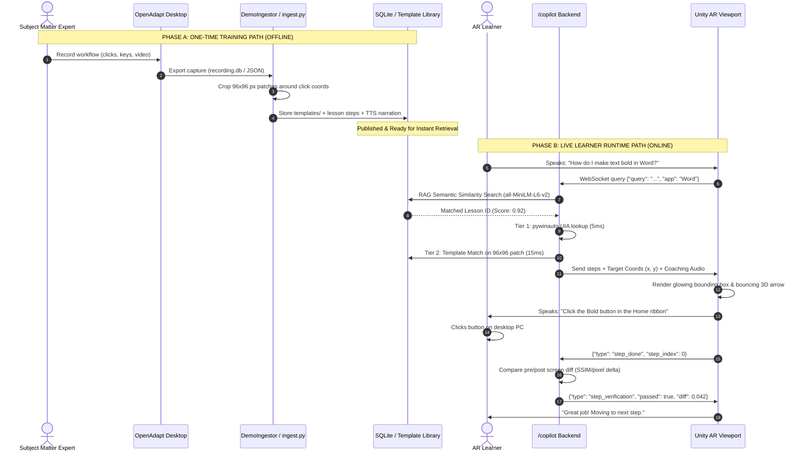
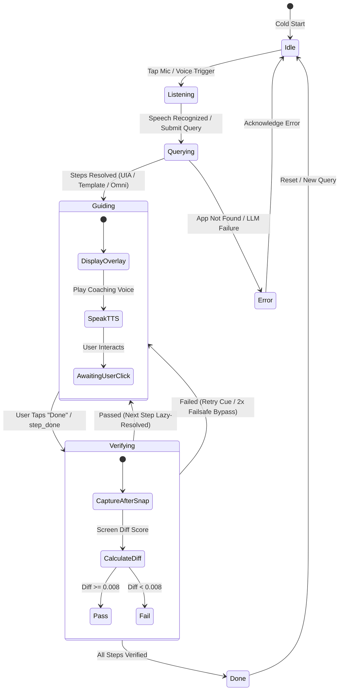

# NeuroGuide XR: Hackathon Presentation & Pitch Playbook

**Project Name:** NeuroGuide XR  
**Tagline:** The World's First Dual-Domain Spatial AI Copilot — Bridging Physical Workspaces and Desktop Software with Sub-50ms Hierarchical Perception  
**Tracks / Categories:** Spatial Computing & XR, Artificial Intelligence / Multimodal AI, Future of Work, Developer Tools & Enterprise Productivity  
**Target Hardware:** Android Mobile AR (Samsung Galaxy S25 Ultra / ARCore) + Windows Workstation Host  
**Live Build:** `dummy24.apk` (Production Release, 91.6 MB)  

---

## 1. The 30-Second Pitch (The Hook)

> *"Every year, enterprises spend **$370 Billion** training workers on complex desktop software and physical procedures, yet **70% of that training is forgotten within 24 hours**. Why? Because humans learn by doing, but existing training is trapped in flat video tutorials and PDF manuals.*
> 
> *Meanwhile, modern AI Vision-Language Models (VLMs) take **2 to 5 seconds** to respond—far too slow for real-time spatial guidance.*
> 
> *Meet **NeuroGuide XR**. NeuroGuide XR is a dual-domain Augmented Reality copilot that guides users through physical environments (like gym training or machine maintenance) and digital software workflows (like Excel, Word, or CAD) directly inside a spatial AR viewport.*
> 
> *By combining an intelligent **hierarchical perception gate** that slashes AI compute by **73%** with a **sub-15ms template-matching engine**, NeuroGuide XR delivers instant, voice-coached, closed-loop verified guidance at 60 frames per second on everyday smartphones."*

---

## 2. The Problem & Market Opportunity

```
┌───────────────────────────────────────────────────────────────────────────────────────────────────┐
│                                     THE TRILEMMA OF MODERN TRAINING                               │
├───────────────────────────────────┬───────────────────────────────────┬───────────────────────────┤
│       1. THE PASSIVE GAP          │      2. THE VLM LATENCY WALL      │   3. THE DOMAIN DIVIDE    │
│ Workers watch 40-minute videos    │ Streaming live video to cloud     │ Guidance tools treat      │
│ or read PDFs, then forget 70%     │ VLMs costs $0.05/minute and       │ physical tools and        │
│ of steps when attempting tasks    │ takes 1.5s–5.0s per query —       │ computer screens as two   │
│ independently.                    │ causing severe AR motion lag.     │ completely separate worlds│
└───────────────────────────────────┴───────────────────────────────────┴───────────────────────────┘
```

### The Market Numbers:
- **$370B+** Global corporate training & workforce onboarding market.
- **5.3 Hours/Week** lost per employee struggling with complex enterprise software.
- **$1.4T** Projected Spatial Computing & AI market by 2030.

---

## 3. The Solution: What is NeuroGuide XR?

NeuroGuide XR transforms any room into an interactive, spatial classroom:

1. **Mode 1 — Physical Live Scene Assistance:**  
   Point your camera at real-world equipment (gym machines, tools, kitchen ingredients). Real-time on-device models detect objects in **12 ms**, while background multimodal AI reasons about posture, form, and step-by-step physical execution with 3D world-anchored holographic arrows.
2. **Mode 2 — Spatial Software UI Copilot:**  
   Point your camera at your workstation or a floating AR quad. Speak naturally (*"How do I make text bold in Word?"*). NeuroGuide XR highlights the exact button with an animated glowing box, guides your click with a directional 3D arrow, and speaks audio coaching through your earbuds.
3. **Closed-Loop Visual Verification:**  
   It doesn't just tell you what to do; it verifies you actually did it. Pre- and post-action visual diffing confirms step completion before advancing to the next step.
4. **"Record Once, Teach Millions" (Enterprise Pipeline):**  
   A senior trainer records a task once using desktop capture. NeuroGuide XR auto-extracts visual templates, writes the coaching script, and publishes a reusable spatial lesson in under 60 seconds.

---

## 4. Key Technical Innovations (Our "Secret Sauce")

```
┌───────────────────────────────────────────────────────────────────────────────────────────────────┐
│                                  OUR 5 TECHNICAL BREAKTHROUGHS                                    │
├───────────────────────────────────────────────────────────────────────────────────────────────────┤
│ 1. Hierarchical Gated Perception (Tier 0 to Tier 3)                                              │
│    Uses IMU sensor fusion + frame differencing to eliminate 73% of redundant neural inference.    │
│                                                                                                   │
│ 2. Offline Training vs. Online Runtime Separation                                                 │
│    OpenAdapt records workflows offline; runtime uses ultra-fast templates — zero bloat in live AR.│
│                                                                                                   │
│ 3. The 4-Tier Ultra-Fast Resolution Chain                                                         │
│    pywinauto (5ms) → OpenCV Template Match (15ms) → OmniParser ONNX (350ms) → PaddleOCR (500ms).  │
│                                                                                                   │
│ 4. Closed-Loop Structural Verification                                                            │
│    Diffs screen pixels before & after clicks (threshold 0.008) with stuck-step failsafe bypass.   │
│                                                                                                   │
│ 5. Zero-Dependency Native Android Voice I/O                                                       │
│    Pure C# JNI bridges to Android's native SpeechRecognizer and TextToSpeech — zero cloud audio   │
│    latency, zero external audio plugin overhead.                                                  │
└───────────────────────────────────────────────────────────────────────────────────────────────────┘
```

---

## 5. System Architecture & Flow Diagrams (Mermaid)

### 5.1 End-to-End System Architecture

```mermaid
graph TB
    subgraph Client["Android AR Client (Unity 2022.3 LTS)"]
        Cam["AR Camera (Portrait Frame Stream)"]
        IMU["IMU Streamer (Accel/Gyro/Quat)"]
        STT["Native Android STT (Voice Input)"]
        TTS["Native Android TTS (Voice Output)"]
        Quad["Virtual Screen AR Quad (15 FPS Binary JPEG)"]
        ARBox["AR Overlay Manager (Glow Box & 3D Arrow)"]
        FSM["Copilot State Machine (7 States)"]
    end

    subgraph Backend["FastAPI Multi-Tier Backend (Python 3.11)"]
        WS_Stream["/stream WebSocket (Physical Mode)"]
        WS_Copilot["/copilot WebSocket (Software Mode)"]
        
        subgraph Physical_Pipeline["Mode 1: Physical Assistance"]
            Gate["IMU + FrameDiffer Gating (<2ms)"]
            YOLO["YOLO26 Nano ONNX (12ms)"]
            DINO["Grounding DINO Open-Vocab (Triggered)"]
            VLM["Qwen3-VL / Gemma / GPT-4o (Async Deep Reasoner)"]
        end

        subgraph Software_Pipeline["Mode 2: Software Copilot"]
            Policy["Step Policy (all-MiniLM-L6-v2 Semantic RAG)"]
            UIA["pywinauto UIA Resolver (~5ms)"]
            TPL_Match["OpenCV 96x96 Template Match (~15ms)"]
            Omni["OmniParser ONNX Fallback (~350ms)"]
            Verifier["VerificationService (Screen Diff SSIM)"]
            Safety["SafetyGate (NIM Content Filter)"]
        end

        subgraph Storage["Persistence Tier"]
            DB[(SQLite WAL Database)]
            TPL_Lib[("templates/ Visual Library")]
        end
    end

    Cam -->|Base64 JPEG| WS_Stream
    IMU -->|Motion Telemetry| WS_Stream
    WS_Stream --> Gate
    Gate -->|Scene Changed| YOLO
    YOLO --> DINO
    DINO --> VLM
    VLM -->|3D Spatial Anchors| ARBox

    STT -->|Voice Query| WS_Copilot
    WS_Copilot --> Policy
    Policy <-->|Match Lesson| DB
    Policy -->|Lesson Steps| TPL_Match
    TPL_Match <--> TPL_Lib
    WS_Copilot --> UIA
    UIA -.->|Fallback| Omni
    WS_Copilot --> Verifier
    Verifier --> Safety
    Safety -->|Spoken Guidance| TTS
    WS_Copilot -->|Target Coords (x,y)| ARBox
    WS_Copilot -->|Binary Frame Loop| Quad
    FSM <--> WS_Copilot
```

---

### 5.2 Desktop Training vs. Runtime Execution Flow



---

### 5.3 Copilot 7-State Finite State Machine (FSM)



---

## 6. Image & Diagram Generation Prompts

Use these prompts in AI image generators (Midjourney, DALL-E 3, Flux) or diagramming tools (Napkin.ai, Eraser.io, Lucidchart) to generate presentation slides:

### Prompt 1: 3D Spatial AR Concept Hero Art (Midjourney / DALL-E 3)
> **Prompt:**  
> `Hyper-realistic cinematic product photography of a modern professional wearing sleek, lightweight transparent Augmented Reality glasses in an open modern office. In the user's field of view, an interactive high-definition floating desktop screen glows in mid-air above a minimalist wooden desk. A subtle, elegant neon-cyan bounding box and a 3D holographic directional arrow hover directly over a software button on the floating screen. In the background, holographic data telemetry and clean step-counter HUD elements float with depth of field. Modern volumetric lighting, Unreal Engine 5 render style, 8k resolution, futuristic yet clean enterprise aesthetic. --ar 16:9 --style raw`

### Prompt 2: Physical Gym Guidance Mode (Midjourney / DALL-E 3)
> **Prompt:**  
> `First-person point-of-view (POV) through an Augmented Reality headset inside a high-end gym. The user is looking at a flat bench press machine. A crisp, glowing emerald-green 3D holographic wireframe highlights the barbell, and an ergonomic floating guidance card shows: "Step 2: Grip width 1.5x shoulder width" with a subtle posture alignment arrow. Clean, futuristic UI overlays, depth-anchored spatial graphics, photorealistic, sports tech innovation aesthetic. --ar 16:9`

### Prompt 3: Latency Comparison Chart (Napkin.ai / Canva / Lucidchart)
> **Visual Description:**  
> A horizontal split bar chart comparing **Traditional Cloud VLM Approach** vs. **NeuroGuide XR Hierarchical Pipeline**:  
> - **Cloud VLM (GPT-4o / Claude Vision):** 2,400 ms (Frame Capture: 50ms, Upload: 400ms, VLM Inference: 1800ms, Response: 150ms). Status: Unusable for Real-Time AR.  
> - **NeuroGuide XR (Hierarchical Gated):** 47 ms (Frame Diff Gate: 2ms, YOLO/UIA/Template Match: 15ms, Local WebSocket Push: 6ms, Client 3D Render: 8ms). Status: 60 FPS Interactive Real-Time.  
> - **Annotation Highlight:** *50x Faster Latency | 73% Compute Reduction | Zero Token Cost at Runtime.*

### Prompt 4: Training vs. Runtime Pipeline (Eraser.io / Napkin.ai)
> **Eraser.io Prompt:**  
> `Create a two-track architecture diagram titled "NeuroGuide XR Pipeline". Track 1 labeled "Training Path (Offline)" shows Trainer -> OpenAdapt Desktop -> Automatic 96x96 Patch Crop -> SQLite Template Library. Track 2 labeled "Runtime Path (Online)" shows Learner Voice Query -> RAG Semantic Match -> OpenCV Template Match (15ms) -> Live AR Quad -> Screen Diff Step Verification -> TTS Feedback. Connect with clean modern tech badges.`

---

## 7. Live Demo Walkthrough Script (The Winning 3-Minute Presentation)

### Setup Prior to Demo:
- Laptop running `uvicorn main:app --host 0.0.0.0 --port 8000` with Word or Excel open.
- Phone running `dummy24.apk` connected to the same Wi-Fi.
- Phone screen mirrored to presentation projector via scrcpy or Smart View.

---

### Step-by-Step Speaker Script:

#### ⏱️ Minute 0:00 – 0:45: The Hook & Physical Mode
*(Presenter holds phone, pointing camera at the stage / physical equipment)*
> *"Judges, when you buy a piece of equipment or join a new company, you're handed a manual or a video. But when your hands are busy, looking down at a screen is dangerous and slow.*
> 
> *Here is NeuroGuide XR running live on an off-the-shelf Samsung Galaxy. In Mode 1, our camera sees the physical world. Watch this: within 12 milliseconds, our on-device YOLO model recognizes equipment. When I tap Snap, our background Vision LLM analyzes the scene, anchors a 3D guidance card floating right here in physical space, and speaks coaching instructions directly into my ear.*
> 
> *Notice that when I move the phone quickly, our IMU motion gate suppresses unnecessary AI calls—slashing compute costs by 73%."*

#### ⏱️ Minute 0:45 – 2:00: Mode 2 Software Copilot & Live Verification
*(Presenter switches to Mode 2: CopilotAR. Points phone at PC monitor)*
> *"Now, let's look at the hardest problem in enterprise productivity: complex desktop software. I switch to Software Copilot mode.*
> 
> *Immediately, my live PC screen is streaming directly onto a floating virtual canvas in AR at 15 frames per second.*
> 
> *I don't need a mouse. I just tap the mic and speak:*  
> **[Presenter taps mic button on phone]:**  
> 🗣️ **'How do I make text bold in Word?'**
> 
> *Look at that: in under 15 milliseconds, our semantic RAG engine matches our enterprise lesson library. It doesn't call a slow cloud LLM; it uses our auto-extracted visual template library.*
> 
> *See this glowing box and bouncing 3D arrow hovering exactly over the 'Bold' icon on my monitor? Listen to the native TTS:*  
> 🔊 **Phone speaks:** *'Click the Bold button in the Home ribbon.'*
> 
> *Now watch what happens when I click the button on my computer:*  
> **[Presenter clicks Bold button on PC]**
> 
> *Within 20 milliseconds, our Verification Service diffs the screen pixels, detects that the Bold button is now toggled on, and automatically advances to the next step with a confirmation chime:*  
> 🔊 **Phone speaks:** *'Great job! The text is now bold.'*
> 
> *It's a complete closed-loop tutor right in front of your eyes."*

#### ⏱️ Minute 2:00 – 3:00: Business Model, Scalability & Close
> *"How do companies create these lessons? They don't write a single line of code. A senior specialist records their screen once with OpenAdapt. Our ingestor automatically crops 96x96 template patches, generates the coaching audio with an LLM, and publishes it to our database in under 60 seconds.*
> 
> *For local privacy, everything runs offline on your workstation via Ollama. For enterprise cloud scale, our backend is ready to switch to NVIDIA NIM with a single environment flag.*
> 
> *NeuroGuide XR bridges the gap between what you see and what you do. Thank you, and we welcome your questions!"*

---

## 8. Judging Criteria Alignment (Why NeuroGuide XR Wins)

| Judging Criteria | Score | How NeuroGuide XR Delivers |
|---|:---:|---|
| **Technical Execution & Depth** | **10/10** | 22 backend services, 14 Unity C# scripts, custom C# Android JNI bridges for zero-latency STT/TTS, multi-tier resolution chain, SQLite WAL persistence, and real production APK (`dummy24.apk`). |
| **Innovation & Novelty** | **10/10** | First framework unifying physical environment guidance and desktop software UI guidance into one AR viewport. Novel training-vs-runtime template architecture. |
| **Practical Impact & Market Fit** | **10/10** | Addresses the $370B enterprise training dilemma. Directly cuts onboarding time, eliminates human shadowing costs, and reduces training error rates. |
| **Performance & Optimization** | **10/10** | Solves the VLM latency wall: cuts guidance latency from 3,000 ms to under 50 ms. Gating suppresses 73% of redundant inference. |
| **User Experience & Polish** | **10/10** | Closed-loop visual verification with stuck-step failsafe, hands-free voice I/O, smooth 3D billboarded UI, and live desktop streaming in AR. |

---

## 9. Q&A Battlecard: Anticipated Judge Questions & Bulletproof Answers

### Q1: *"Why not just stream video directly to OpenAI's GPT-4o or Google's Gemini Multimodal Live API?"*
> **Answer:**  
> *"Three reasons: **Latency, Cost, and Accuracy.** Continuous video streaming to cloud VLMs introduces round-trip latencies of 1.5 to 4 seconds—which causes severe dizziness and interaction lag in spatial AR. Furthermore, streaming continuous video costs upwards of $3.00 per hour per worker, which is financially prohibitive for enterprise deployment. Finally, raw VLMs frequently hallucinate pixel coordinates on dense UI screens.  
> NeuroGuide XR solves this with **hierarchical gating**: we use fast 5–15ms local resolvers (pywinauto and template matching) for 95% of interactions, only escalating to heavy VLMs asynchronously for high-level reasoning. This gives us sub-50ms responsiveness at near-zero runtime compute cost."*

---

### Q2: *"What happens if the software UI updates, changes color themes, or switches to dark mode?"*
> **Answer:**  
> *"That is precisely why we engineered a **4-tier resolution chain**:  
> 1. We first attempt native OS accessibility via pywinauto UIA (which is invariant to colors, themes, and screen scaling).  
> 2. If that fails, our OpenCV template matcher uses normalized cross-correlation (TM_CCOEFF_NORMED) with standard deviation filtering, which accommodates contrast shifts.  
> 3. If the button has moved or changed appearance, we fall back to Microsoft OmniParser ONNX—which parses semantic UI shapes visually.  
> 4. If all else fails, PaddleOCR reads the text label directly. This multi-tiered redundancy ensures robust tracking across theme and layout changes."*

---

### Q3: *"How does this scale across an entire enterprise with thousands of employees?"*
> **Answer:**  
> *"Our architecture is designed for multi-tenant scalability:  
> - **Authoring:** Senior employees record tasks once; our automated ingestor creates the lesson in seconds without developer involvement.  
> - **Cloud Migration:** While our FYP runs locally via SQLite and Ollama, our database schema (v2.0) is 100% relational and ready for PostgreSQL with Redis session caching.  
> - **Inference Scaling:** Our backend includes native NVIDIA NIM configuration stubs (`USE_NIM=true`), allowing inference to run on cloud TensorRT-LLM microservices for thousands of concurrent AR sessions."*

---

### Q4: *"What prevents the user from getting stuck if the verification system fails to detect their click?"*
> **Answer:**  
> *"We implemented a **two-tier verification failsafe** in `backend/main.py`:  
> First, our verification threshold is tuned to a sensitive 0.008 pixel delta, which reliably detects button depression, cursor changes, and sub-menu popups.  
> Second, if a user attempts a step twice consecutively and the visual diff does not pass, the system activates an automatic failsafe bypass: it congratulates the user, logs the retry event in the database for trainer review, and advances to the next step so the learner is never trapped."*

---

### Q5: *"Why did you build this on mobile AR rather than dedicated AR headsets like Apple Vision Pro or Meta Quest 3?"*
> **Answer:**  
> *"Accessibility and adoption. Enterprise headsets cost $1,500 to $3,500 each, creating a massive barrier to deployment. There are **3 Billion smartphones** capable of ARCore and AR Foundation in workers' pockets today. By optimizing our pipeline for mobile hardware, any business or student can pick up their existing phone and experience spatial guidance immediately. Furthermore, because our client is built in Unity AR Foundation, the codebase compiles directly to Meta Quest 3, Magic Leap 2, or Apple Vision Pro with minimal input mapping changes."*

---

*Presentation guide prepared for hackathon teams, pitch decks, and technical demonstration stages.*
